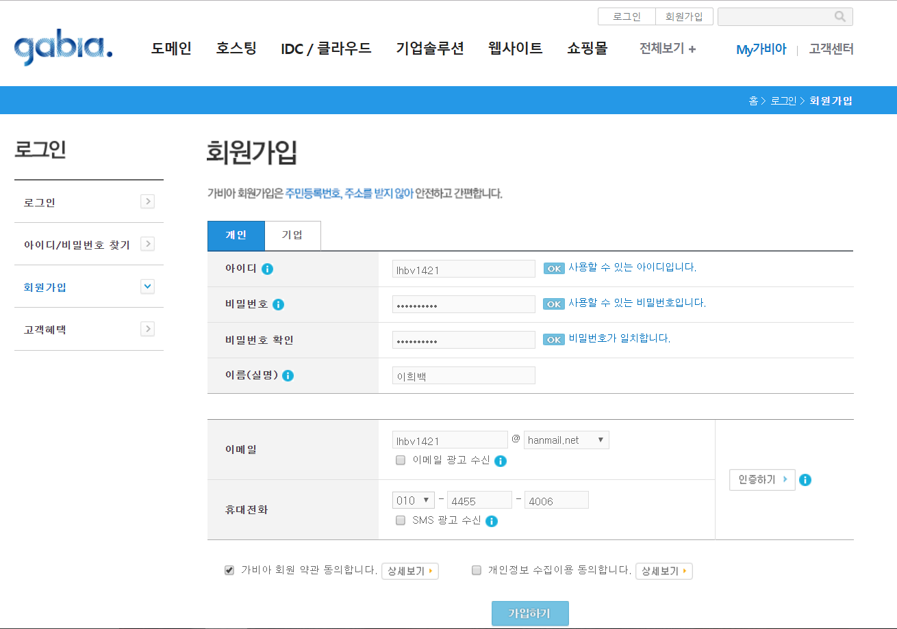
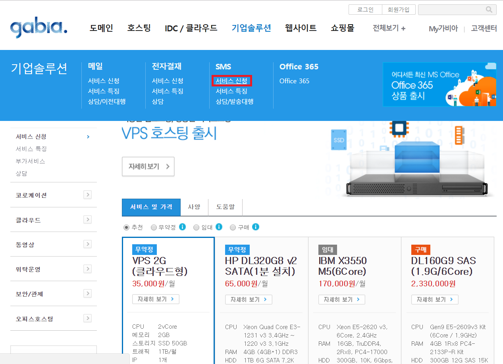
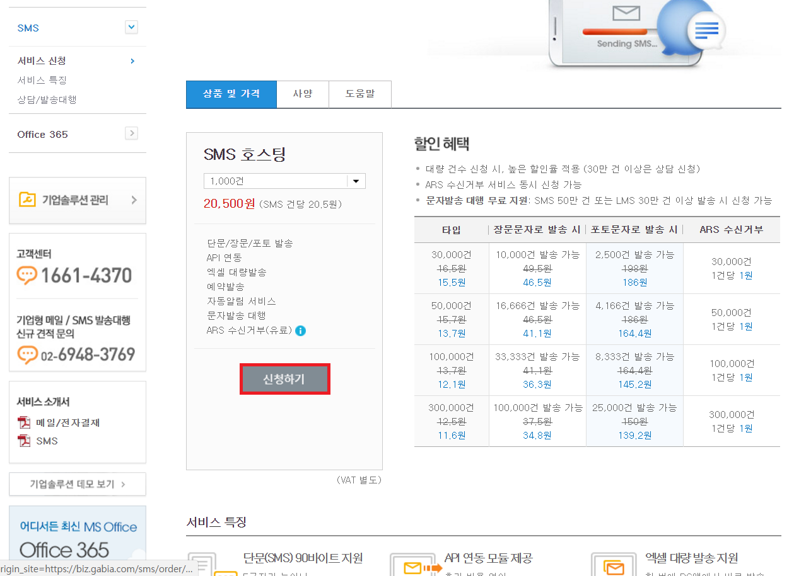
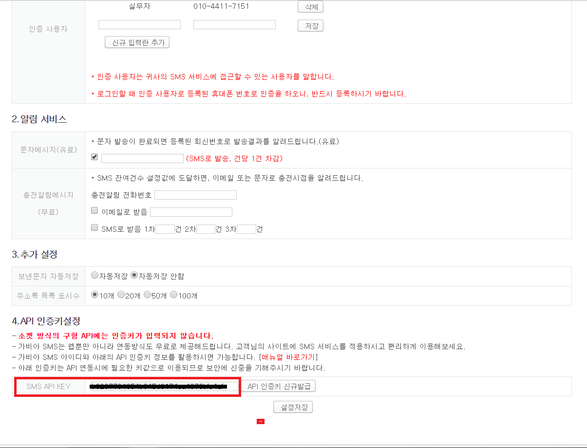
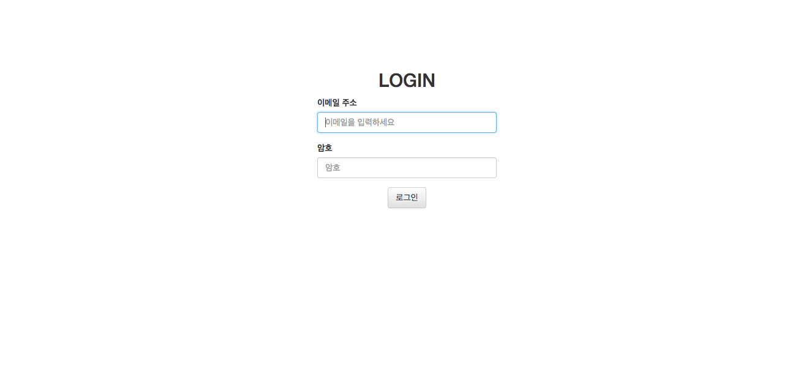
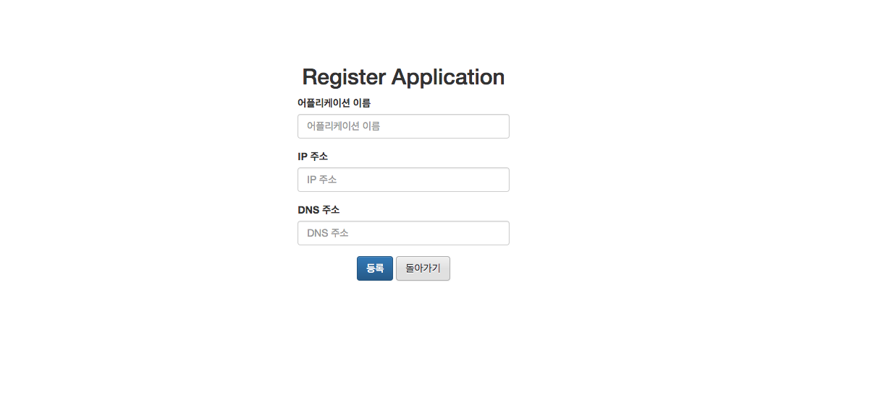

# Hedwig

## 5분만에 만드는 나만의 문자 서버

## SlideShare

http://www.slideshare.net/ssusere35c84/hedwig-gescc

## 소개/시연 동영상

https://youtu.be/4vM9dsVdup4

### Getting Start

**Gabia API 등록**  
* 회원가입  

	  

* SMS 서비스 신청  

	  
	  

* API KEY 추출  

	

**Service 사용**  
* 배포된 jar 파일을 다운받아 설치한다.

```shell
$ wget https://github.com/GESCC/hedwig/releases/download/v0.4.0/hedwig-0.4.0.tar
$ tar xvf hedwig-0.4.0.tar
$ cd hedwig-0.4.0
```

* 기본 사용자 정보와 서비스 api 정보를 입력한 후 실행한다.  

```shell
$ sudo java -jar hedwig-0.4.0-SNAPAHOT.jar --defaultEmail=UserEmail --defaultPassword=Password --defaultPhonenumber=PhoneNumber --api.key=Your API Key(gabia) --api.id=API id (gabia) --api.sendNumber=PhoneNumber
```

```shell
#exmaple
$ sudo java -jar hedwig-0.4.0-SNAPAHOT.jar --defaultEmail=test@hanmail.net --defaultPassword=test --defaultPhonenumber=01012345678 --api.key=dlyguich2hkxo57kebcel2 --api.id=test --api.sendNumber=01012345678
```

* 메인 페이지에서 기본 사용자를 사용하거나 또는 회원가입을 하여 로그인한다.  

	  

* 어플리케이션을 등록한다.  

	  

* SMS를 전송한다.  

**Push sms**

```http
POST /sms
```
**_Request_**

```json
{
"title":"테스트",
"receiver_number":"010-1234-5678",
"application_name":"Pandora",
"contents":"테스트 문자 발송",
"callback_url":"http://www.pandora.com/result"
}
```

**_Response_**

```json
SUCCESS { "code":"200", "message":"OK" } 
```
```json
FAIL { "code":"500", "message":"Server Internal Error"}
```

## 사용 가능 호스팅 업체
* Gabia(default)
* Tongkni(구현예정)
* SmsService Interface를 상속받아 개인의 입맛에 맞게 구현 가능

### 빌드 요구사양
JDK 7+  
Maven 3.2.x+

## 사용한 오픈소스
Spring 4.1.1  
Spring Boot 1.4.2  
Aspectj 1.6.10  
SLF4J 1.6.6  
JUnit 4.12  
Jackson 1.9.13  
JQuery 1.12.0  
Bootstrap 3.3.2  
Unirest-java 1.4.9  
